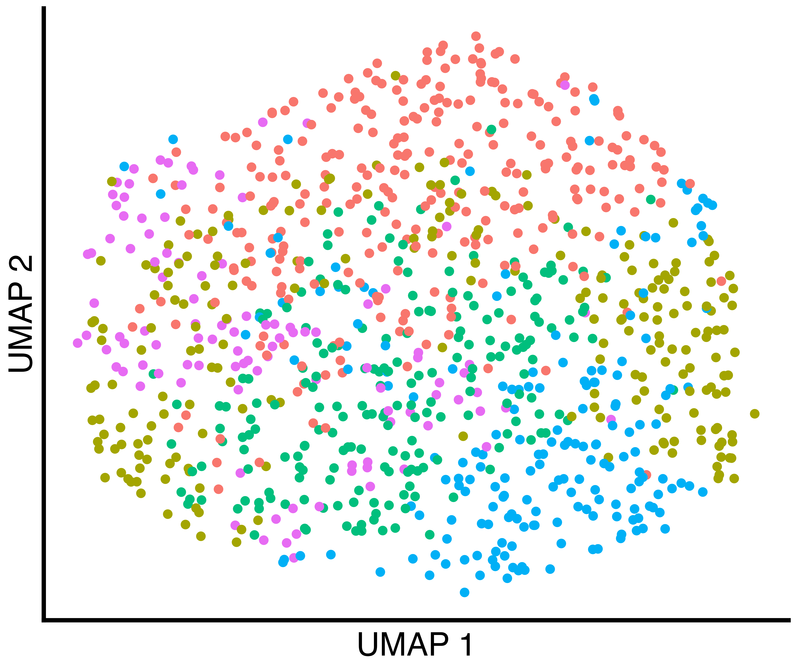
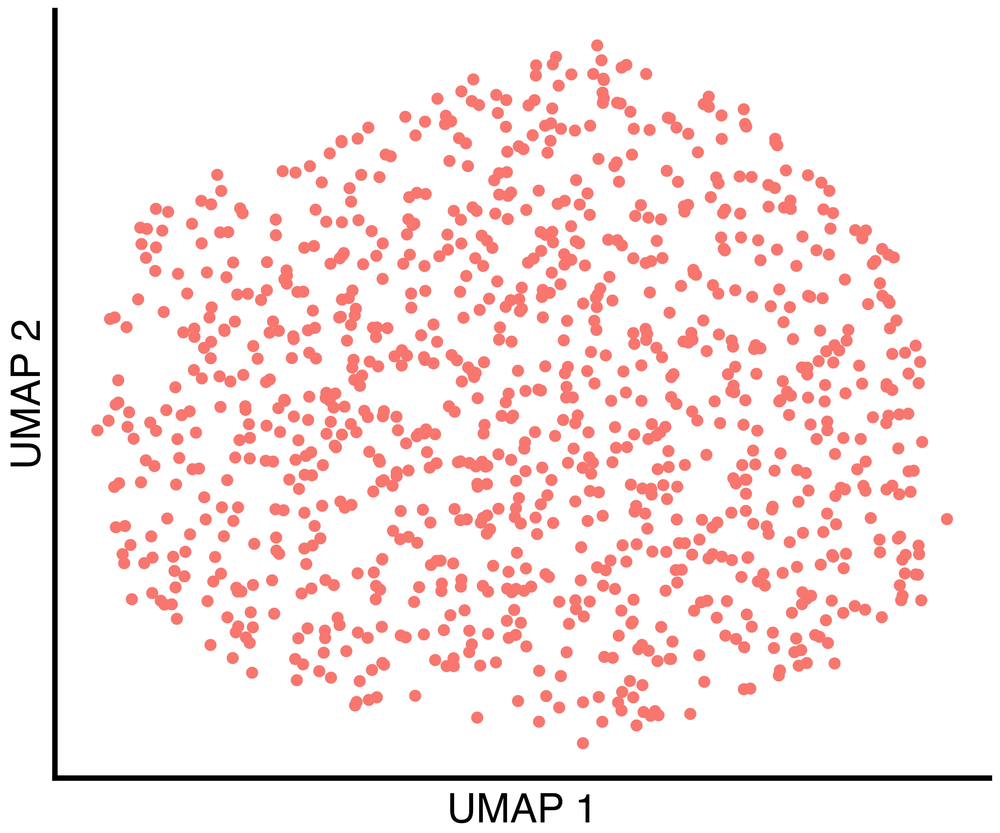
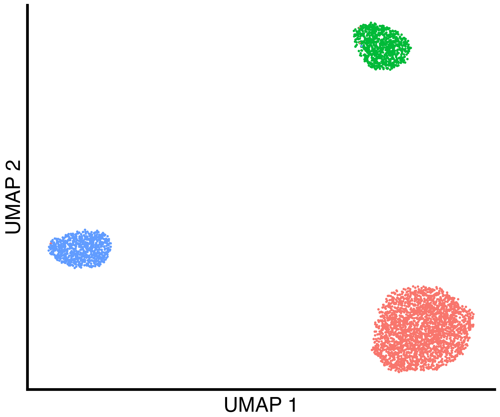
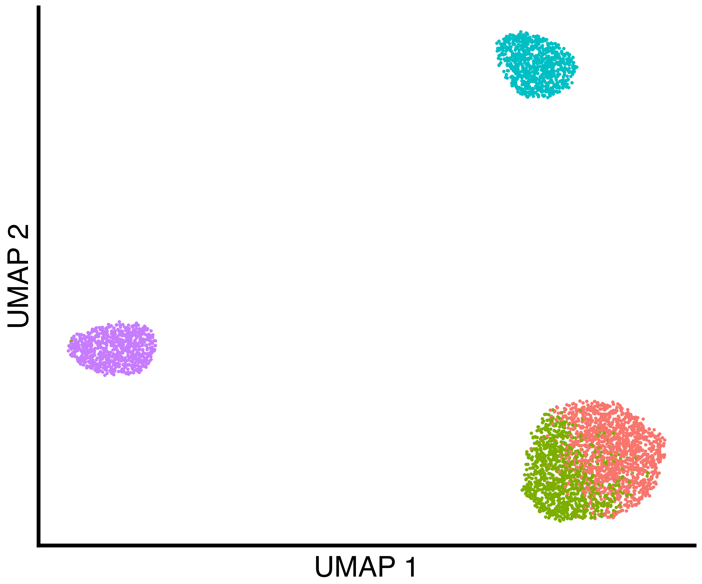
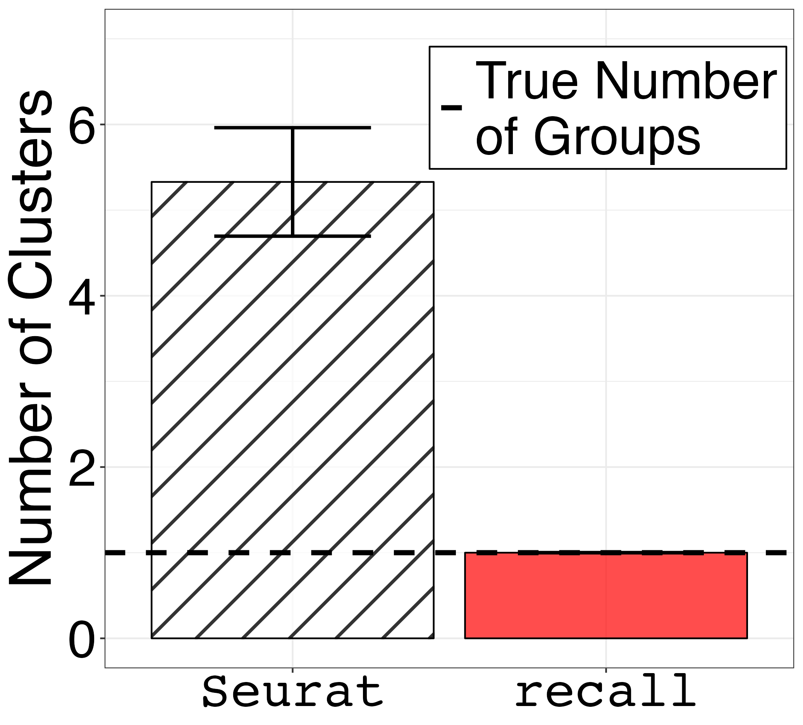

```{r, include = FALSE}
knitr::opts_chunk$set(
  collapse = TRUE,
  comment = "#>"
)

knitr::opts_chunk$set(warning = FALSE)


knitr::opts_chunk$set(eval = FALSE)

```

```{r setup}
suppressPackageStartupMessages({
library(splatter)
library(Seurat)
library(SeuratObject)

library(patchwork)
library(grid)

library(recall)
})

```

# Simulated Data With One True Group

First, we simulate data using `splatter` and convert the data format to a
 `SeuratObject`. Setting `group.prob = c(1.0)` results in a  single group.

```{r one_group_simulation}
sim.groups <- splatter::splatSimulate(group.prob = c(1.0), method = "groups",
                                      verbose = FALSE,
                                      nGenes = 1000,
                                      batchCells = 1000,
                                      dropout.type = "experiment", 
                                      de.prob = 0.05)

seurat_obj <- Seurat::as.Seurat(sim.groups, counts = "counts", data = NULL)
seurat_obj <- SeuratObject::RenameAssays(object = seurat_obj, originalexp = 'RNA')

seurat_obj@meta.data$Group = 1
```


Then, we run a typical analysis using `Seurat` and also cluster using `recall`.

```{r one_group_simulation_seurat}
seurat_obj <- recall::seurat_workflow(seurat_obj, num_variable_features = 1000, resolution_param = 0.8)
```

```{r one_group_simulation_recall}
seurat_obj <- recall::FindClustersRecall(seurat_obj, cores=6)
```

Finally, we plot a UMAP of the results including the true labels (only one in
this case), the clusters found by `Seurat` with default parameters, and the
clusters found by `recall`.

```{r one_group_simulation_plots}
simulation_one_group_scatter <- recallreproducibility::custom_scatter(seurat_obj, reduction = "umap", group_by = "Group", x_title = "UMAP 1", y_title = "UMAP 2", pt.size = 6) + Seurat::NoLegend()
simulation_one_group_seurat_scatter <- recallreproducibility::custom_scatter(seurat_obj, reduction = "umap", group_by = "seurat_clusters", x_title = "UMAP 1", y_title = "UMAP 2", pt.size = 6) + Seurat::NoLegend() 
simulation_one_group_recall_scatter <- recallreproducibility::custom_scatter(seurat_obj, reduction = "umap", group_by = "recall_clusters", x_title = "UMAP 1", y_title = "UMAP 2", pt.size = 6) + Seurat::NoLegend()

ggplot2::ggsave("one_group_scatter.png", simulation_one_group_scatter, width = 1.2 * 2^12, height = 2^12, units = "px")
ggplot2::ggsave("one_group_seurat_scatter.png", simulation_one_group_seurat_scatter, width = 1.2 * 2^12, height = 2^12, units = "px")
ggplot2::ggsave("one_group_recall_scatter.png", simulation_one_group_recall_scatter, width = 1.2 * 2^12, height = 2^12, units = "px")
```


True Groups             |  Seurat Clusters | recall Clusters
:-------------------------:|:-------------------------:|:-------------------------:
{width=100%}  |  {width=100%}  |  {width=100%}


# Simulated Data With Three True Groups

First, we simulate data using `splatter` and convert the data
format to a `SeuratObject`. Setting `group.prob = c(0.6, 0.2, 0.2)`
results in three groups in proportions of 60%, 20%, and 20%.


```{r three_groups_simulation}

sim.groups <- splatter::splatSimulate(group.prob = c(0.6, 0.2, 0.2), method = "groups",
                            verbose = FALSE,
                            nGenes = 1000,
                            batchCells = 4000,
                            dropout.type = "experiment", 
                            de.prob = 0.05)

seurat_obj <- Seurat::as.Seurat(sim.groups, counts = "counts", data = NULL)
seurat_obj <- SeuratObject::RenameAssays(object = seurat_obj, originalexp = 'RNA')
```


Then, we run a typical analysis using `Seurat` and also cluster using `recall`.

```{r three_groups_simulation_seurat}
seurat_obj <- recall::seurat_workflow(seurat_obj, num_variable_features = 1000, resolution_param = 0.8)
```

```{r three_groups_simulation_recall}
seurat_obj <- recall::FindClustersRecall(seurat_obj, cores=6)
```

We plot a UMAP of the results including the true labels, the clusters
found by `Seurat` with default parameters, and the clusters found by `recall`.

```{r three_groups_simulation_plots}
simulation_three_groups_group_scatter <- recallreproducibility::custom_scatter(seurat_obj, reduction = "umap", group_by = "Group", x_title = "UMAP 1", y_title = "UMAP 2", pt.size = 2) + Seurat::NoLegend()
simulation_three_groups_seurat_scatter <- recallreproducibility::custom_scatter(seurat_obj, reduction = "umap", group_by = "seurat_clusters", x_title = "UMAP 1", y_title = "UMAP 2", pt.size = 2) + Seurat::NoLegend() 
simulation_three_groups_recall_scatter <- recallreproducibility::custom_scatter(seurat_obj, reduction = "umap", group_by = "recall_clusters", x_title = "UMAP 1", y_title = "UMAP 2", pt.size = 2) + Seurat::NoLegend()


ggplot2::ggsave("three_group_scatter.png", simulation_three_groups_group_scatter, width = 1.2 * 2^12, height = 2^12, units = "px")
ggplot2::ggsave("three_group_seurat_scatter.png", simulation_three_groups_seurat_scatter, width = 1.2 * 2^12, height = 2^12, units = "px")
ggplot2::ggsave("three_group_recall_scatter.png", simulation_three_groups_recall_scatter, width = 1.2 * 2^12, height = 2^12, units = "px")
```

True Groups             |  Seurat Clusters | recall Clusters
:-------------------------:|:-------------------------:|:-------------------------:
{width=100%}  |  {width=100%}  |  {width=100%}


We plot the grid of UMAPs.

```{r umap_grid}
column_label_1 <- wrap_elements(panel = textGrob('True Labels', gp = gpar(fontsize = 64)))
column_label_2 <- wrap_elements(panel = textGrob('Seurat Default', gp = gpar(fontsize = 64)))
column_label_3 <- wrap_elements(panel = textGrob('recall', gp = gpar(fontsize = 64, fontfamily = "Courier")))


umap_grid <- column_label_1 + column_label_2 + column_label_3 +
  simulation_one_group_scatter + simulation_one_group_seurat_scatter + simulation_one_group_recall_scatter +
  column_label_1 + column_label_2 + column_label_3 +
  simulation_three_groups_group_scatter + simulation_three_groups_seurat_scatter + simulation_three_groups_recall_scatter +
  plot_layout(widths = c(5, 5, 5),
              heights = c(1,3,1,3))

ggplot2::ggsave("umap_grid.png", umap_grid, width = 2 * 1.5 * 2^12, height = 2 * 2^12, units = "px")
```

{width=100%}


We repeat this simulation 1000 times and save the results.
```{r replicates}
num_replicates <- 1000

num_seurat_clusters <- c()
num_callback_clusters <- c()

for (i in 1:num_replicates) {
  print("Replicate")
  print(i)
  sim.groups <- splatter::splatSimulate(group.prob = c(1.0),
                                        method = "groups",
                                        seed = i,
                                        verbose = FALSE,
                                        nGenes = 1000,
                                        batchCells = 1000,
                                        dropout.type = "experiment", 
                                        de.prob = 0.05)
  
  seurat_obj <- Seurat::as.Seurat(sim.groups, counts = "counts", data = NULL)
  seurat_obj <- SeuratObject::RenameAssays(object = seurat_obj, originalexp = 'RNA')
  
  seurat_obj@meta.data$Group = 1
  
  seurat_obj <- callback::seurat_workflow(seurat_obj, num_variable_features = 1000, resolution_param = 0.8, algorithm = "NA", visualization_method = "NA")
  seurat_obj <- callback::FindClustersCallback(seurat_obj, cores=12)
  
  num_seurat_clusters[i] <- length(levels(seurat_obj@meta.data$seurat_clusters))
  num_callback_clusters[i] <- length(levels(seurat_obj@meta.data$callback_clusters))
}

num_groups <- rep(1, num_replicates)

df_1_group <- data.frame(num_groups, num_seurat_clusters, num_callback_clusters)


num_seurat_clusters <- c()
num_callback_clusters <- c()

for (i in 1:num_replicates) {
  print("Replicate")
  print(i)
  sim.groups <- splatter::splatSimulate(group.prob = c(0.6, 0.2, 0.2), method = "groups",
                                        verbose = FALSE,
                                        nGenes = 1000,
                                        batchCells = 4000,
                                        dropout.type = "experiment", 
                                        de.prob = 0.05)
  
  seurat_obj <- Seurat::as.Seurat(sim.groups, counts = "counts", data = NULL)
  seurat_obj <- SeuratObject::RenameAssays(object = seurat_obj, originalexp = 'RNA')

  seurat_obj <- callback::seurat_workflow(seurat_obj, num_variable_features = 1000, resolution_param = 0.8, algorithm = "NA", visualization_method = "NA")
  seurat_obj <- callback::FindClustersCallback(seurat_obj, cores=24)
  
  num_seurat_clusters[i] <- length(levels(seurat_obj@meta.data$seurat_clusters))
  num_callback_clusters[i] <- length(levels(seurat_obj@meta.data$callback_clusters))
}

num_groups <- rep(3, num_replicates)

df_3_groups <- data.frame(num_groups, num_seurat_clusters, num_callback_clusters)


write.csv(df_1_group, "one_group.csv")
write.csv(df_3_groups, "three_groups.csv")
```


Finally, we plot panels 1c and 1e

library(ggplot2)
library(reshape2)
library(dplyr)
library(ggpattern)

setwd("~/Desktop/callback_review_scripts/figure1/")

```{r plot_replicates}

small_text_size <- 32
large_text_size <-36

df_1_group <- read.csv("one_group.csv", row.names = 1)
df_1_group$num_groups <- NULL # drop unnecessary column

df_3_groups <- read.csv("three_groups.csv", row.names = 1)
df_3_groups$num_groups <- NULL # drop unnecessary column


melted_df_1 <- melt(df_1_group) 

df_summary_1_group <- melted_df_1 %>%
  group_by(variable) %>%
  summarize(mean = mean(value),
            sd = sd(value))

colnames(df_summary_1_group) <- c("method", "mean", "sd")


barplot_error_bars1 <- ggplot(df_summary_1_group) +
  geom_bar_pattern(aes(x=method, y=mean, fill=method, pattern=method), 
                   stat="identity",
                   position = "dodge",
                   color = "black",
                   alpha = 0.7,
                   pattern_fill = "black",
                   pattern_angle = 45,
                   pattern_density = 0.05,
                   pattern_spacing = 0.05,
                   pattern_key_scale_factor = 0.6) +
  scale_pattern_manual(values = c(num_seurat_clusters = "stripe", num_callback_clusters = "none")) + 
  geom_errorbar( aes(x=method, ymin=mean-sd, ymax=mean+sd), width = 0.5, size=1) + 
  geom_hline(size = 1.5, aes(yintercept = 1, linetype="True Number\nof Groups")) +
  scale_linetype_manual(values = 2) +
  theme_bw() + 
  xlab("Method") +
  ylab("Number of Clusters") +
  theme(axis.text.x = element_text(size = small_text_size, family = "Courier", color="black"),
        axis.text.y = element_text(size = small_text_size, color="black"),
        axis.title = element_text(size = large_text_size),
        axis.title.x = element_blank(),
        strip.text = element_text(size = small_text_size), 
        legend.text = element_text(size = small_text_size),
        legend.title = element_blank(),
        plot.title = element_text(size = large_text_size, hjust = 0.5),
        legend.position=c(0.73, 0.85),
        legend.background = element_rect(colour = 'black', fill = 'white', linetype='solid')) +
  scale_x_discrete(labels = c("Seurat", "recall")) +
  scale_fill_manual(values = c("white", "red"), labels = c("recall", "Seurat")) + 
  ylim(0,7) + 
  guides(fill="none", pattern="none")


melted_df_3 <- melt(df_3_groups) 

df_summary_3_groups <- melted_df_3 %>%
  group_by(variable) %>%
  summarize(mean = mean(value),
            sd = sd(value))

colnames(df_summary_3_groups) <- c("method", "mean", "sd")


barplot_error_bars3 <- ggplot(df_summary_3_groups) +
  geom_bar_pattern(aes(x=method, y=mean, fill=method, pattern=method), 
                   stat="identity",
                   position = "dodge",
                   color = "black",
                   alpha = 0.7,
                   pattern_fill = "black",
                   pattern_angle = 45,
                   pattern_density = 0.05,
                   pattern_spacing = 0.05,
                   pattern_key_scale_factor = 0.6) +
  scale_pattern_manual(values = c(num_seurat_clusters = "stripe", num_callback_clusters = "none")) + 
  geom_errorbar( aes(x=method, ymin=mean-sd, ymax=mean+sd), width = 0.5, size=1) + 
  geom_hline(size = 1.5, aes(yintercept = 3, linetype="True Number\nof Groups")) +
  scale_linetype_manual(values = 2) +
  theme_bw() + 
  xlab("Method") +
  ylab("Number of Clusters") + 
  theme(axis.text.x = element_text(size = small_text_size, family = "Courier", color="black"),
        axis.text.y = element_text(size = small_text_size, color="black"),
        axis.title = element_text(size = large_text_size),
        axis.title.x = element_blank(),
        strip.text = element_text(size = small_text_size), 
        legend.text = element_text(size = small_text_size),
        legend.title = element_blank(),
        plot.title = element_text(size = large_text_size, hjust = 0.5),
        legend.position=c(0.73, 0.85),
        legend.background = element_rect(colour = 'black', fill = 'white', linetype='solid')) +
  scale_x_discrete(labels = c("Seurat", "recall")) + 
  scale_fill_manual(values = c("white", "red"), labels = c("recall", "Seurat")) + 
  ylim(0,7) + 
  guides(fill="none", pattern="none")


barplot_error_bars1 + barplot_error_bars3

ggsave("fig1c.png", barplot_error_bars1, width = 1.2 * 1.2 * 1440, height = 1.3 * 1440, units = "px")
ggsave("fig1e.png", barplot_error_bars3, width = 1.2 * 1.2 * 1440, height = 1.3 * 1440, units = "px")
```

One Goup                   |  Three Groups
:-------------------------:|:-------------------------:
{width=100%} | {width=100%}


