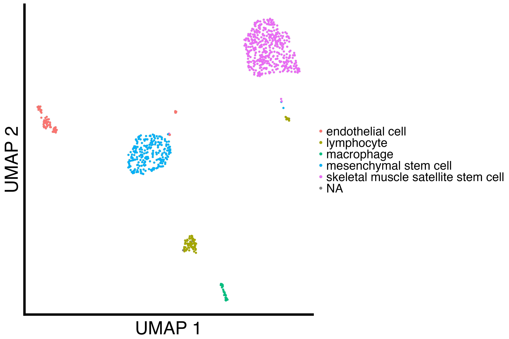
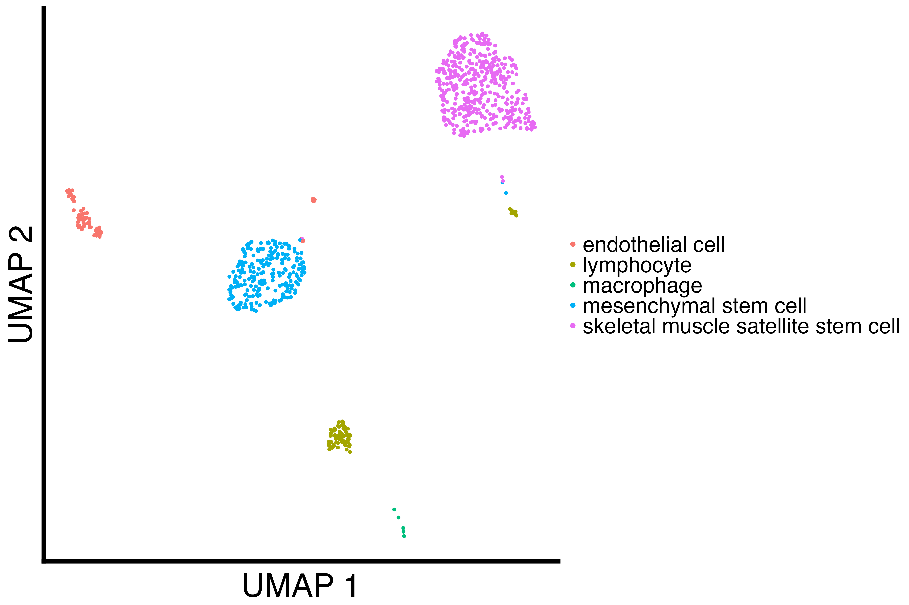
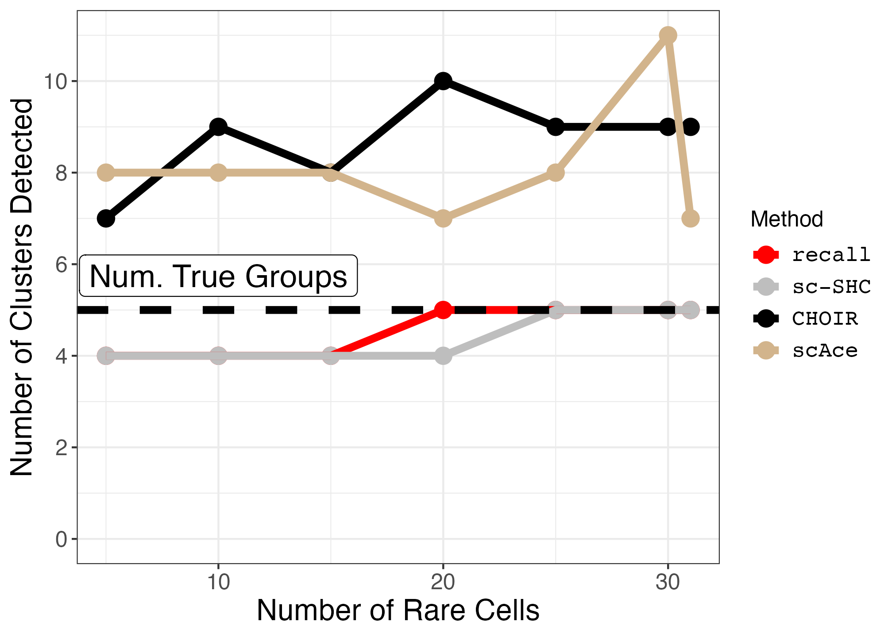
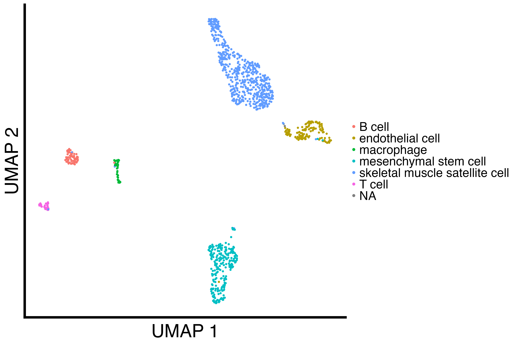
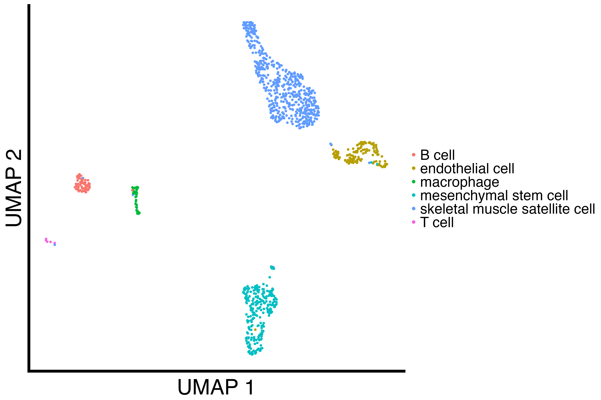
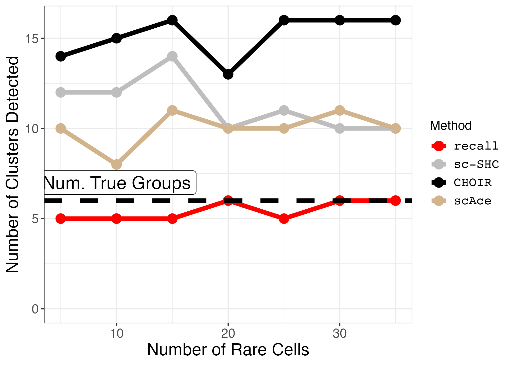

```{r, include = FALSE}
knitr::opts_chunk$set(
  collapse = TRUE,
  comment = "#>"
)


knitr::opts_chunk$set(eval = FALSE)
```


```{r setup}
suppressPackageStartupMessages({
  library(splatter)
  library(Seurat)
  library(SeuratObject)
  library(SeuratDisk)

  library(patchwork)
  library(grid)
  library(ggplot2)
  library(reshape2)
  library(scales)
  
  library(recall)
  library(scSHC)
  library(CHOIR)

  library(LaplacesDemon)
})

set.seed(123456)
```


We begin by defining several functions. First, a function for downsampling a particular cell type.
```{r downsample_cell_type}
seurat_num_clusters <- c()
recall_num_clusters <- c()

downsample_cell_type <- function(seurat_obj, cell_type, num_downsampled) {
  cells_to_downsample <- Cells(seurat_obj)[which(seurat_obj@meta.data$cell_ontology_class == cell_type)]
  cells_to_keep <- Cells(seurat_obj)[which(seurat_obj@meta.data$cell_ontology_class != cell_type)]
  downsampled_cells <-  sample(cells_to_downsample, size = num_downsampled)
  
  subsetted_seurat_obj = subset(seurat_obj, cells = c(downsampled_cells, cells_to_keep))
  
  return(subsetted_seurat_obj)
}
```


Next, we write a function for downsampling a particular cell type over several different counts down to 5 cells.
```{r rare_cell_type_titration}
rare_cell_type_titration <- function(seurat_obj,
                                    cell_type,
                                    tissue_name,
                                    downsampled_counts) {
  
  # set up vectors for results
  tissue <- c()
  num_groups <- c()
  downsampled_count <- c()

  recall_num_clusters <- c()
  scSHC_num_clusters <- c()
  CHOIR_num_clusters <- c()
  
  cores = 12
  
  j = 0
  for (num_downsampled in downsampled_counts) {
    j = j + 1
    
    downsampled_seurat_obj <- downsample_cell_type(seurat_obj, cell_type = cell_type, num_downsampled)
    
    
    # save file to h5ad for scAce clustering
    # this also fixes a bug in CHOIR using Seuratv5
    downsampled_seurat_obj[["RNA3"]] <- as(object = downsampled_seurat_obj[["RNA"]], Class = "Assay")
    DefaultAssay(downsampled_seurat_obj) <- "RNA3"
    downsampled_seurat_obj[["RNA"]] <- NULL
    downsampled_seurat_obj[["RNA"]] <- downsampled_seurat_obj[["RNA3"]]
    DefaultAssay(downsampled_seurat_obj) <- "RNA"
    downsampled_seurat_obj[["RNA3"]] <- NULL
    
    filename = stringr::str_interp("h5ad_dir/${tissue_name}_${num_downsampled}_downsampled.h5Seurat")
    SaveH5Seurat(downsampled_seurat_obj, filename = filename)
    Convert(filename, dest = "h5ad")
    
    downsampled_seurat_obj <- NormalizeData(downsampled_seurat_obj)
    downsampled_seurat_obj <- FindVariableFeatures(downsampled_seurat_obj)
    downsampled_seurat_obj <- ScaleData(downsampled_seurat_obj)
    downsampled_seurat_obj <- RunPCA(downsampled_seurat_obj)
    downsampled_seurat_obj <- FindNeighbors(downsampled_seurat_obj)
    
    # null out previous clustering columns
    downsampled_seurat_obj@reductions$CHOIR_P0_reduction <- NULL
    downsampled_seurat_obj@meta.data$CHOIR_clusters_0.05 <- NULL
    downsampled_seurat_obj@meta.data$CHOIR_clusters <- NULL
    downsampled_seurat_obj@meta.data$recall_idents <- NULL
    downsampled_seurat_obj@meta.data$scSHC_clusters <- NULL
    

    # run CHOIR
    print("Running CHOIR")
    downsampled_seurat_obj <- CHOIR(downsampled_seurat_obj, 
                                    n_cores = cores,
                                    reduction = downsampled_seurat_obj@reductions$pca@cell.embeddings[, 1:10],
                                    var_features = Seurat::VariableFeatures(downsampled_seurat_obj))
    
    # run recall
    print("Running recall")
    downsampled_seurat_obj <- recall::FindClustersRecall(downsampled_seurat_obj, cores=cores)
    
    # run sc-SHC
    print("Running sc-SHC")
    scSHC_clusters <- scSHC(GetAssayData(downsampled_seurat_obj,
                                         assay = "RNA", layer = "counts")[Seurat::VariableFeatures(downsampled_seurat_obj),],
                            num_features = length(VariableFeatures(downsampled_seurat_obj)),
                            num_PCs = 10,
                            cores = cores)[[1]]
    
    # store cluster labels
    downsampled_seurat_obj[['scSHC_clusters']] <- scSHC_clusters
    downsampled_seurat_obj[["CHOIR_clusters"]] <- downsampled_seurat_obj@meta.data$CHOIR_clusters_0.05
    
    # store output data
    tissue[j] <- tissue_name
    num_groups[j] <- length(levels(factor(seurat_obj@meta.data$cell_ontology_class)))
    downsampled_count[j] <- num_downsampled

    recall_num_clusters[j] <- length(unique(downsampled_seurat_obj@meta.data$recall_clusters))
    scSHC_num_clusters[j] <- length(unique(downsampled_seurat_obj@meta.data$scSHC_clusters))
    CHOIR_num_clusters[j] <- length(unique(downsampled_seurat_obj@meta.data$CHOIR_clusters))
    
  }
  
  # save downsampled files for scAce
  return(data.frame(tissue, num_groups, downsampled_count, recall_num_clusters, scSHC_num_clusters, CHOIR_num_clusters))
}
```


We analyze the Diaphragm tissue by downsampling the smallest cell type.
```{r diaphragm_analysis}
diaphragm <- readRDS("Diaphragmcluster_results_seurat.rds")
table(diaphragm@meta.data$cell_ontology_class)

# macrophage has 31 cells, so we downsample
diaphragm_downsampled_counts <- c(31, 30, 25, 20, 15, 10, 5)
diaphragm_cell_type <- "macrophage"
diaphragm_results <- rare_cell_type_titration(diaphragm, diaphragm_cell_type, "Diaphragm", diaphragm_downsampled_counts)

write.csv(diaphragm_results, "diaphragm_downsampling.csv")
```


We analyze the Limb muscle tissue by downsampling the smallest cell type.
```{r limb_muscle_analysis}
limb_muscle <- readRDS("Limb_Musclecluster_results_seurat.rds")
table(limb_muscle@meta.data$cell_ontology_class)

# macrophage has 45 cells, so we downsample
limb_muscle_downsampled_counts <- c(35, 30, 25, 20, 15, 10, 5)
limb_muscle_cell_type <- "T cell"
limb_muscle_results <- rare_cell_type_titration(limb_muscle, limb_muscle_cell_type, "Limb_muscle", limb_muscle_downsampled_counts)

write.csv(limb_muscle_results, "limb_muscle_downsampling.csv")
```


We load the previous clustering results.
```{r load_clustering_results}
diaphragm_df <- read.csv("diaphragm_downsampling.csv", row.names = 1)
limb_muscle_df <- read.csv("limb_muscle_downsampling.csv", row.names = 1)


diaphragm_df <- melt(diaphragm_df, measure.vars = c("recall_num_clusters", "scSHC_num_clusters", "CHOIR_num_clusters" ))
limb_muscle_df <- melt(limb_muscle_df, measure.vars = c("recall_num_clusters", "scSHC_num_clusters", "CHOIR_num_clusters" ))


# add scAce results
scAce_df <- read.csv("scAce_results.csv", row.names = 1)

diaphragm_scAce_df <- subset(scAce_df, tissue == "Diaphragm")
limb_muscle_scAce_df <- subset(scAce_df, tissue == "Limb_muscle")


diaphragm_scAce_df <- melt(diaphragm_scAce_df, measure.vars = c("scAce_num_clusters" ))
limb_muscle_scAce_df <- melt(limb_muscle_scAce_df, measure.vars = c("scAce_num_clusters"))


diaphragm_df <- rbind(diaphragm_df, diaphragm_scAce_df)
limb_muscle_df <- rbind(limb_muscle_df, limb_muscle_scAce_df)
```


We write a function for plotting the downsampling results.
```{r plot_downsample}
plot_downsample <- function(df, true_groups, annotation_pos) {
  small_text_size <- 12
  large_text_size <- 16
  
  linewidth = 2
  pt_size = 4
  
  p <- ggplot(df, aes(x=downsampled_count, y=value, color=variable)) +
    geom_point(size=pt_size) +
    geom_line(size=linewidth) +
    geom_hline(yintercept=true_groups, linetype="dashed", size=linewidth) +  
    expand_limits(y=0) +
    theme_bw() + 
    ggplot2::scale_color_manual(values = c("red", "grey", "black", "tan"), labels = c('recall','sc-SHC','CHOIR', "scAce")) +
    ggplot2::scale_y_continuous(breaks = breaks_pretty()) +
    #scale_y_continuous(breaks=seq(0,150,30)) + 
    ggplot2::xlab("Number of Rare Cells") + 
    ggplot2::ylab("Number of Clusters Detected") +
    ggplot2::labs(color = "Method") + 
    ggplot2::annotate("label", x = 10, y = annotation_pos, label = "Num. True Groups", size = 6) +
    ggplot2::theme(axis.text = ggplot2::element_text(size = small_text_size),
                   axis.title = ggplot2::element_text(size = large_text_size),
                   strip.text = ggplot2::element_text(size = small_text_size), 
                   legend.text = ggplot2::element_text(size = small_text_size, family = "Courier"),
                   legend.title = ggplot2::element_text(size = small_text_size))
  return(p)
}
```


We plot the Diaphragm results.
```{r plot_diaphgram}
diaphragm <- readRDS("Diaphragmcluster_results_seurat.rds")
diaphragm_downsampled <- downsample_cell_type(diaphragm, "macrophage", 5)

diaphragm_umap <- recallreproducibility::custom_scatter(diaphragm, "umap", "cell_ontology_class", "UMAP 1", "UMAP 2", 2)
diaphragm_downsampled_umap <- recallreproducibility::custom_scatter(diaphragm_downsampled, "umap", "cell_ontology_class", "UMAP 1", "UMAP 2", 2)
diaphragm_downsampled_plot <- plot_downsample(diaphragm_df, true_groups = 5, annotation_pos = 5.75)

ggsave("diaphragm_umap.png", diaphragm_umap, height = 1.3 * 2 * 1440, width = 1.3 * 3 * 1440, units = "px")
ggsave("diaphragm_downsampled_umap.png", diaphragm_downsampled_umap, height = 1.3 * 2 * 1440, width = 1.3 * 3 * 1440, units = "px")
ggsave("diaphragm_downsampled_plot.png", diaphragm_downsampled_plot, width = 1.4 * 1440, height = 1440, units = "px")
```
Original Diaphgragm UMAP            |  Downsampled Diaphgragm UMAP                    | Diaphgragm Downsampled Plot
:----------------------------------:|:-----------------------------------------------:|:----------------------------------------------:|
{width=100%} | {width=100%} | {width=100%}


We plot the Limb muscle results.
```{r plot_limb_muscle}
limb_muscle <- readRDS("Limb_Musclecluster_results_seurat.rds")
limb_muscle_downsampled <- downsample_cell_type(limb_muscle, "T cell", 5)

limb_muscle_umap <- recallreproducibility::custom_scatter(limb_muscle, "umap", "cell_ontology_class", "UMAP 1", "UMAP 2", 2)
limb_muscle_downsampled_umap <- recallreproducibility::custom_scatter(limb_muscle_downsampled, "umap", "cell_ontology_class", "UMAP 1", "UMAP 2", 2)
limb_muscle_downsampled_plot <- plot_downsample(limb_muscle_df, true_groups = 6, annotation_pos = 7)

ggsave("limb_muscle_umap.png", limb_muscle_umap, height = 1.3 * 2 * 1440, width = 1.3 * 3 * 1440, units = "px")
ggsave("limb_muscle_downsampled_umap.png", limb_muscle_downsampled_umap, height = 1.3 * 2 * 1440, width = 1.3 * 3 * 1440, units = "px")
ggsave("limb_muscle_downsampled_plot.png", limb_muscle_downsampled_plot, width = 1.4 * 1440, height = 1440, units = "px")
```
Original Limb Muscle UMAP             |  Downsampled Limb Muscle UMAP                     | Limb Muscle Downsampled Plot
:------------------------------------:|:-------------------------------------------------:|:------------------------------------------------:|
{width=100%} | {width=100%} | {width=100%}


