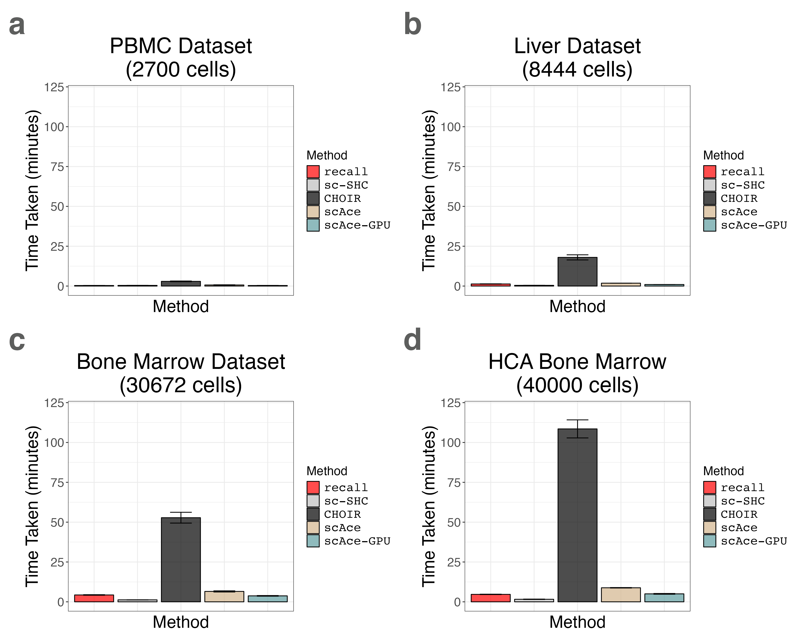
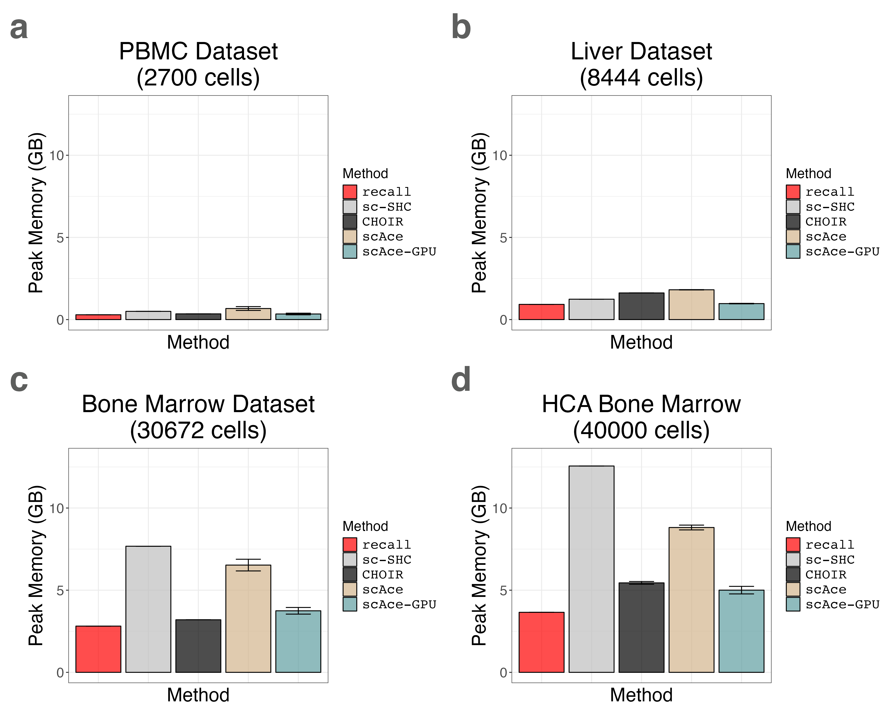

```{r, include = FALSE}
knitr::opts_chunk$set(
  collapse = TRUE,
  comment = "#>"
)

knitr::opts_chunk$set(eval = FALSE)
```

```{r setup}
suppressPackageStartupMessages({

library(recallreproducibility)

library(dplyr)
library(ggplot2)
library(patchwork)
})
```


We load the liver benchmarking data.
```{r load_liver_data}

liver_timing_df1 <- read.csv("liver_timing1.csv", header = TRUE, row.names = 1)
liver_timing_df2 <- read.csv("liver_timing2.csv", header = TRUE, row.names = 1)
liver_timing_df3 <- read.csv("liver_timing3.csv", header = TRUE, row.names = 1)
liver_timing_df4 <- read.csv("liver_timing4.csv", header = TRUE, row.names = 1)
liver_timing_df5 <- read.csv("liver_timing5.csv", header = TRUE, row.names = 1)

liver_timing_df <- rbind(liver_timing_df1, liver_timing_df2, liver_timing_df3, liver_timing_df4, liver_timing_df5)

liver_timing_df$method <- factor(liver_timing_df$method, levels = c("recall", "sc-SHC", "CHOIR"))

# add scAce data
scace_liver <- subset(scace_timing_df, dataset == "liver")
scace_liver$dataset <- NULL # drop dataset since it isn't in the other dfs
gpu_scace_liver <- subset(gpu_scace_timing_df, dataset == "liver")
gpu_scace_liver$dataset <- NULL # drop dataset since it isn't in the other dfs

liver_timing_df <- rbind(liver_timing_df, scace_liver, gpu_scace_liver)

liver_timing_df$method <- factor(liver_timing_df$method, levels = c("recall", "sc-SHC", "CHOIR", "scAce", "scAce-GPU"))
```

We plot the liver benchmarking data.
```{r plot_liver_data}


liver_timing_bar_plot <-  timing_barplot(liver_timing_df, title = "Liver Dataset\n(8444 cells)")
liver_memory_bar_plot <-  memory_barplot(liver_timing_df, title = "Liver Dataset\n(8444 cells)")
```


We load the PBMC 3K benchmarking data.
```{r load_pbmc3k_data}
pbmc3k_timing_df1 <- read.csv("pbmc3k_timing1.csv", header = TRUE, row.names = 1)
pbmc3k_timing_df2 <- read.csv("pbmc3k_timing2.csv", header = TRUE, row.names = 1)
pbmc3k_timing_df3 <- read.csv("pbmc3k_timing3.csv", header = TRUE, row.names = 1)
pbmc3k_timing_df4 <- read.csv("pbmc3k_timing4.csv", header = TRUE, row.names = 1)
pbmc3k_timing_df5 <- read.csv("pbmc3k_timing5.csv", header = TRUE, row.names = 1)

pbmc3k_timing_df <- rbind(pbmc3k_timing_df1, pbmc3k_timing_df2, pbmc3k_timing_df3, pbmc3k_timing_df4, pbmc3k_timing_df5)

pbmc3k_timing_df$method <- factor(pbmc3k_timing_df$method, levels = c("recall", "sc-SHC", "CHOIR"))

# add scace
pbmc3k_timing_df$cores <- NULL
scace_pbmc3k <- subset(scace_timing_df, dataset == "pbmc3k")
scace_pbmc3k$dataset <- NULL # drop dataset since it isn't in the other dfs
gpu_scace_pbmc3k <- subset(gpu_scace_timing_df, dataset == "pbmc3k")
gpu_scace_pbmc3k$dataset <- NULL # drop dataset since it isn't in the other dfs

pbmc3k_timing_df <- rbind(pbmc3k_timing_df, scace_pbmc3k, gpu_scace_pbmc3k)


pbmc3k_timing_df$method <- factor(pbmc3k_timing_df$method, levels = c("recall", "sc-SHC", "CHOIR", "scAce", "scAce-GPU"))
```


We plot the PBMC 3K benchmarking data.
```{r plot_pbmc3k_data}
pbmc3k_timing_bar_plot <-  timing_barplot(pbmc3k_timing_df, title = "PBMC Dataset\n(2700 cells)")
pbmc3k_memory_bar_plot <-  memory_barplot(pbmc3k_timing_df, title = "PBMC Dataset\n(2700 cells)")
```


We load the Bone Marrow 30K benchmarking data.
```{r load_bone_marrow_30k_data}
bmcite_timing_df1 <- read.csv("bmcite_timing1.csv", header = TRUE, row.names = 1)
bmcite_timing_df2 <- read.csv("bmcite_timing2.csv", header = TRUE, row.names = 1)
bmcite_timing_df3 <- read.csv("bmcite_timing3.csv", header = TRUE, row.names = 1)
bmcite_timing_df4 <- read.csv("bmcite_timing4.csv", header = TRUE, row.names = 1)
bmcite_timing_df5 <- read.csv("bmcite_timing5.csv", header = TRUE, row.names = 1)

bmcite_timing_df <- rbind(bmcite_timing_df1, bmcite_timing_df2, bmcite_timing_df3, bmcite_timing_df4, bmcite_timing_df5)

bmcite_timing_df$method <- factor(bmcite_timing_df$method, levels = c("recall", "sc-SHC", "CHOIR"))


bmcite_timing_df$cores <- NULL


# add scace
scace_bmcite <- subset(scace_timing_df, dataset == "bmcite")
scace_bmcite$dataset <- NULL # drop dataset since it isn't in the other dfs
gpu_scace_bmcite <- subset(gpu_scace_timing_df, dataset == "bmcite")
gpu_scace_bmcite$dataset <- NULL # drop dataset since it isn't in the other dfs


bmcite_timing_df <- rbind(bmcite_timing_df, scace_bmcite, gpu_scace_bmcite)

bmcite_timing_df$method <- factor(bmcite_timing_df$method, levels = c("recall", "sc-SHC", "CHOIR", "scAce", "scAce-GPU"))
```


We plot the Bone Marrow 30K benchmarking data.
```{r plot_bone_marrow_30k_data}
bmcite_timing_bar_plot <-  timing_barplot(bmcite_timing_df, title = "Bone Marrow Dataset\n(30672 cells)")
bmcite_memory_bar_plot <-  memory_barplot(bmcite_timing_df, title = "Bone Marrow Dataset\n(30672 cells)")
```


We load the Bone Marrow 40K benchmarking data.
```{r load_bone_marrow_40k_data}
hcabm40k_timing_df1 <- read.csv("hcabm40k_timing1.csv", header = TRUE, row.names = 1)
hcabm40k_timing_df2 <- read.csv("hcabm40k_timing2.csv", header = TRUE, row.names = 1)
hcabm40k_timing_df3 <- read.csv("hcabm40k_timing3.csv", header = TRUE, row.names = 1)
hcabm40k_timing_df4 <- read.csv("hcabm40k_timing4.csv", header = TRUE, row.names = 1)
hcabm40k_timing_df5 <- read.csv("hcabm40k_timing5.csv", header = TRUE, row.names = 1)

hcabm40k_timing_df <- rbind(hcabm40k_timing_df1, hcabm40k_timing_df2, hcabm40k_timing_df3, hcabm40k_timing_df4, hcabm40k_timing_df5)

hcabm40k_timing_df$method <- factor(hcabm40k_timing_df$method, levels = c("recall", "sc-SHC", "CHOIR"))

# add scace
hcabm40k_timing_df$cores <- NULL

scace_hcabm40k <- subset(scace_timing_df, dataset == "hcabm40k")
scace_hcabm40k$dataset <- NULL # drop dataset since it isn't in the other dfs
gpu_scace_hcabm40k <- subset(gpu_scace_timing_df, dataset == "hcabm40k")
gpu_scace_hcabm40k$dataset <- NULL # drop dataset since it isn't in the other dfs

hcabm40k_timing_df <- rbind(hcabm40k_timing_df, scace_hcabm40k, gpu_scace_hcabm40k)


hcabm40k_timing_df$method <- factor(hcabm40k_timing_df$method, levels = c("recall", "sc-SHC", "CHOIR", "scAce", "scAce-GPU"))
```


We load the scAce timing data for.

```{r scAce}
scace_timing_df <- read.csv("scace_timing.csv", header = TRUE, row.names = 1)
gpu_scace_timing_df <- read.csv("gpu_scace_timing.csv", header = TRUE, row.names = 1)
gpu_scace_timing_df$method <- "scAce-GPU"

# convert from GB to Mebibytes since the function converts as to GB
scace_timing_df$memory <- scace_timing_df$memory / 0.00104858
gpu_scace_timing_df$memory <- gpu_scace_timing_df$memory / 0.00104858
```


We plot the Bone Marrow 30K benchmarking data.
```{r plot_bone_marrow_40k_data}
hcabm40k_timing_bar_plot <-  timing_barplot(hcabm40k_timing_df, title = "HCA Bone Marrow\n(40000 cells)")
hcabm40k_memory_bar_plot <-  memory_barplot(hcabm40k_timing_df, title = "HCA Bone Marrow\n(40000 cells)")
```

We create a grid of barplots for both runtime and peak memory usage.
```{r plot_grids}
timing_grid <- pbmc3k_timing_bar_plot +
  liver_timing_bar_plot +
  bmcite_timing_bar_plot +
  hcabm40k_timing_bar_plot +
  plot_annotation(tag_levels = 'a') &
  theme(plot.tag = element_text(size = 40, face = "bold", color = "#5D5E5D"))

memory_grid <- pbmc3k_memory_bar_plot +
  liver_memory_bar_plot +
  bmcite_memory_bar_plot +
  hcabm40k_memory_bar_plot +
  plot_annotation(tag_levels = 'a') &
  theme(plot.tag = element_text(size = 40, face = "bold", color = "#5D5E5D"))
```


Finally, we save the plots.
```{r save_plots}
ggplot2::ggsave("multi_dataset_timing.png", timing_grid, width = 1.5 * 2 * 1440, height = 1.2 * 2 * 1440, units = "px")
ggplot2::ggsave("multi_dataset_memory.png", memory_grid, width = 1.5 * 2 * 1440, height = 1.2 * 2 * 1440, units = "px")
```


{width=100%}
{width=100%}
